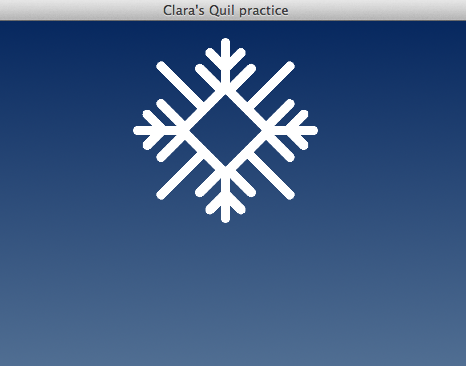

I want to create something cool with Quil!
===========================================

    This is a story of Clara who attended a ClojureBridge workshop recently.
    At the workshop, she learned what Clojure is and how to write Clojure code.
    That really impressed her, "How functional!"
    Also, Clara met an interesting drawing tool, Quil, which is written in Clojure.
    When Clara learned how to use Quil, she thought, "I want to create something cool with Quil!"
    Here's how Clara developed her own Quil application.

## Step 1. Snowflake on a blue background

Clara considered where to start.
Then, a small light turned on in her mind, "a white snowflake on a blue background looks nice."
What she wanted to know was how to make a background blue and put a snowflake on it.
Clara already learned how to find the way. It was:

1. Go to the API documentation website
2. Google it

So, Clara went to the Quil API web site,
[http://quil.info/api](http://quil.info/api), and found the
[Loading and Displaying](http://quil.info/api/image/loading-and-displaying)
section. Then, she found the
[background-image](http://quil.info/api/color/setting#background-image)
function.

Then, she googled and found a StackOverflow question,
[Load/display image in clojure with quil](http://stackoverflow.com/questions/18714941/load-display-image-in-clojure-with-quil),
which looked like what she needed.

Those gave her enough information to accomplish step 1.

At the ClojureBridge workshop, Clara went though the Quil app
tutorial,
[Making Your First Program with Quil](https://github.com/ClojureBridge/drawing/blob/master/curriculum/first-program.md),
so she already had the `drawing` Clojure project.  She decided to use
the same project for her own app.

### Create a new source file

Clara added a new file under `src/drawing` directory with the name
`practice.clj`.  At this point, her directory structure looks like the
below:

```
| LICENSE
| README.md
| project.clj
| src
| | drawing
| | | core.clj
| | | lines.clj
| | | practice.clj
```

### Make the source code clojure-ish

First, Clojure source code has a namespace declaration, so Clara
copy-pasted `ns` from the top of her `lines.clj` file. But, she
changed the name from `drawing.lines` to `drawing.practice`, because
her new file has the name `practice`.

At this moment, `practice.clj` looks like this:

```clojure
(ns drawing.practice
  (:require [quil.core :as q]))
```

### Add basic Quil code

Basic Quil code has `setup` and `draw` functions, along with a
`defsketch` macro, which defines the app. Following these Quil rules,
Clara added those things into her `practice.clj`.

Now, `practice.clj` looks like this:

```clojure
(ns drawing.practice
  (:require [quil.core :as q]))

(defn setup [])

(defn draw [])

(q/defsketch practice
  :title "Clara's Quil practice"
  :size [1000 1000]
  :setup setup
  :draw draw
  )
```

### Load snowflake and background images

Looking at the Quil API and the StackOverflow question, Clara learned
that where to put her image files was important. She created a new
directory, `images`, under the top `drawing` directory, and she and
[put two images there](https://github.com/ClojureBridge/drawing/tree/master/images).

Now, her directory structure looks like the one below:

```
| LICENSE
| README.md
| project.clj
| src
| | drawing
| | | core.clj
| | | lines.clj
| | | practice.clj
| images
| | blue_background.png
| | white_flake.png
```

Since the images were ready, it was time to code using the Quil API.

Clara added a few lines of code to the `setup` and `draw` functions in
`practice.clj` to load and draw two images. She was careful when
writing the image filenames because it should reflect the actual
directory structure.

At this moment, `practice.clj` looks like this:

```clojure
(ns drawing.practice
  (:require [quil.core :as q]))

(def flake (ref nil))        ;; reference to snowflake image
(def background (ref nil))   ;; reference to blue background image

(defn setup []
  ;; loading two images
  (dosync
   (ref-set flake (q/load-image "images/white_flake.png"))
   (ref-set background (q/load-image "images/blue_background.png"))))

(defn draw [state]
  ;; drawing blue background and a snowflake on it
  (if @background
    (do
      (q/background-image @background)
      (q/image @flake 400 state))
    (println "The file " "images/blue_background.png" " has not been loaded")))

(q/defsketch practice
  :title "Clara's Quil practice"
  :size [1000 1000]
  :setup setup
  :draw draw)
```

When Clara ran this code, she saw this image:



Woohoo! She made it!


## Step 2. Snowflake falling down

Clara was satisfied with the image of the white snowflake on the blue
background. However, that was boring.

Next, she wanted to move the snowflake like it was falling down. This
needed further Quil API study and googling.

Moving some pieces in the image is called "animation". She learned
that Quil had two choices: a legacy, simple way and a new style using
a framework.

Her choice was the new framework style, since the coding looked
simple.


### Add framework

Clara read the document
[Functional mode (fun mode)](https://github.com/quil/quil/wiki/Functional-mode-(fun-mode))
and added two lines to her `practice.clj`:

1. `[quil.middleware :as m]` in the `ns` form
2. `:middleware [m/fun-mode]` in the `q/defsketch` form


At this point, `practice.clj` looks like this:

```clojure
(ns drawing.practice
  (:require [quil.core :as q]
            [quil.middleware :as m]))

(def flake (ref nil))        ;; reference to snowflake image
(def background (ref nil))   ;; reference to blue background image

(defn setup []
  ;; loading two images
  (dosync
   (ref-set flake (q/load-image "images/white_flake.png"))
   (ref-set background (q/load-image "images/blue_background.png"))))

(defn draw [state]
  ;; drawing blue background and a snowflake on it
  (if @background
    (do
      (q/background-image @background)
      (q/image @flake 400 state))
    (println "The file " "images/blue_background.png" " has not been loaded")))

(q/defsketch practice
  :title "Clara's Quil practice"
  :size [1000 1000]
  :setup setup
  :draw draw
  :middleware [m/fun-mode])
```

### Add state update

"Well," Clara thought, "What does 'moving the snowflake like it was
falling down' mean in terms of programming?"

To draw the snowflake, she used Quil's `image` function, described in
the API:
[image](http://quil.info/api/image/loading-and-displaying#image).

The x and y parameters were 400 and 10 from the upper-left corner,
which was the position she set to draw the snowflake. To make it fall
down, the y parameter should be increased as time goes by.

In terms of programming, 'moving the snowflake like it was falling
down' means:

1. Set the initial state--for example, `(x, y) = (400, 10)`
2. Draw the background first, then the snowflake
3. Update the state - increase the `y` parameter--for example, `(x, y) = (400, 11)`
4. Draw the background again first, then the snowflake
5. Repeat 2 and 3, increasing the `y` parameter.

In her application, "changing state" includes only the `y`
parameter. How could she increment the `y` value by one?

Yes, Clojure has the `inc` function. This is the function she used.

Here's what she did:

1. Add a new function `update` which will increment the `y` parameter by one
2. Change the `draw` function to take the argument `state`
3. Change `q/image` function's parameter to see the `state`
4. Add the `update` function in the `q/defsketch` form


At this point, `practice.clj` looks like this:

```clojure
(ns drawing.practice
  (:require [quil.core :as q]
            [quil.middleware :as m]))

(def flake (ref nil))        ;; reference to snowflake image
(def background (ref nil))   ;; reference to blue background image

(defn setup []
  ;; loading two images
  (dosync
   (ref-set flake (q/load-image "images/white_flake.png"))
   (ref-set background (q/load-image "images/blue_background.png")))
  (q/smooth)
  (q/frame-rate 60)
  10)

(defn update [state]
  ;; updating y parameter by one
  (inc state))

(defn draw [state]
  ;; drawing blue background and a snowflake on it
  (if @background
    (do
      (q/background-image @background)
      (q/image @flake 400 state))
    (println "The file " "images/blue_background.png" " has not been loaded")))

(q/defsketch practice
  :title "Clara's Quil practice"
  :size [1000 1000]
  :setup setup
  :update update
  :draw draw
  :middleware [m/fun-mode])
```

When Clara ran this code--hey! She saw that the snowflake was falling
down.


## Step 3. Make the snowflake keep falling down from top to bottom

Clara has a nice Quil app. But, once the snowflake went down beyond
the bottom line, that was it. Only a blue background remained. So, she
wanted it to repeat again and again.

In other words: if the snowflake reaches the bottom, it should come
back to the top. Then, it should fall down again.

In terms of programming, what does that mean?

If the `state` (`y` parameter) is greater than the height of the
image, `state` will go back to `0`. Otherwise, the `state` will be
incremented by one.

OK, Clara learned `if`, which is used for flow control, at the
ClojureBridge workshop:
[Flow Control](https://github.com/ClojureBridge/curriculum/blob/master/outline/flow_control.md).

So, she used `if` to make the snowflake go back to the top in the
update function.

At this point, `practice.clj` looks like this:

```clojure
(ns drawing.practice
  (:require [quil.core :as q]
            [quil.middleware :as m]))

(def flake (ref nil))        ;; reference to snowflake image
(def background (ref nil))   ;; reference to blue background image

(defn setup []
  ;; loading two images
  (dosync
   (ref-set flake (q/load-image "images/white_flake.png"))
   (ref-set background (q/load-image "images/blue_background.png")))
  (q/smooth)
  (q/frame-rate 60)
  10)

(defn update [state]
  (if (>= state (q/height))  ;; state is greater than or equal to image height?
    0                        ;; true - get it back to the 0 (top)
    (inc state)              ;; false - increment y parameter by one
    ))

(defn draw [state]
  ;; drawing blue background and a snowflake on it
  (if @background
    (do
      (q/background-image @background)
      (q/image @flake 400 state))
    (println "The file " "images/blue_background.png" " has not been loaded")))


(q/defsketch practice
  :title "Clara's Quil practice"
  :size [1000 1000]
  :setup setup
  :update update
  :draw draw
  :middleware [m/fun-mode])
```

Clara saw the snowflake appear from the top after it went down below
the bottom line.


## Step 4. Make more snowflakes fall down from top to bottom

Looking at the snowflake fall down many times is nice. But, Clara
wanted to see more snowflakes falling down: one or more on the left
half, as well as one or more on the right half.

Again, she needed to think in terms of programming.

This would be "draw mutiple images with the different `x` parameters."
The easiest way to do that is to copy-paste `(q/image @flake 400
state)` mutiple times with the different `x` parameters. For example,

```clojure
(q/image @flake 150 state)
(q/image @flake 400 state)
(q/image @flake 650 state)
```

But, for Clara, this did not look nice; she learned a lot about
Clojure and wanted to use what she knew.

First, she thought about how to keep multiple `x` parameters. She
remembered there was a `vector` in the
[Data Structures](https://github.com/ClojureBridge/curriculum/blob/master/outline/data_structures.md)
section, which looked a good fit in this case.

Here's what she did to add more snowflakes:

1. Add a vector which has multiple `x` parameters with `def`.
2. Draw snowflakes as many times as the number of `x`-params using `doseq`.

* See, [doseq](http://clojuredocs.org/clojure.core/doseq) for more info.

At this point, `practice.clj` looks like this:

```clojure
(ns drawing.practice
  (:require [quil.core :as q]
            [quil.middleware :as m]))

(def flake (ref nil))        ;; reference to snowflake image
(def background (ref nil))   ;; reference to blue background image
(def x-params [100 400 700]) ;; x parameters for three snowflakes

(defn setup []
  ;; loading two images
  (dosync
   (ref-set flake (q/load-image "images/white_flake.png"))
   (ref-set background (q/load-image "images/blue_background.png")))
  (q/smooth)
  (q/frame-rate 60)
  10)

(defn update [state]
  (if (>= state (q/height)) ;; state is greater than or equal to image height?
    0                       ;; true - get it back to the 0 (top)
    (inc state)             ;; false - increment y parameter by one
    ))

(defn draw [state]
  ;; drawing blue background and mutiple snowflakes on it
  (if @background
    (do
      (q/background-image @background)
      (doseq [x x-params]
        (q/image @flake x state)))
    (println "The file " "images/blue_background.png" " has not been loaded")))


(q/defsketch practice
  :title "Clara's Quil practice"
  :size [1000 1000]
  :setup setup
  :update update
  :draw draw
  :middleware [m/fun-mode])
```

Yeah! Clara saw three snowflakes that kept falling down.


## Step 5. Make snowflakes keep falling down at different rates

So far, so good.

But, Clara felt something was not quite right. All three snowflakes
fell down simultaneously, which does not look very natural. So, she
wanted to make them fall down at different rates.

Using programming terms, the problem here is that all three snowflakes
share the same `y` parameter.

Adding multiple `y` values would solve the problem--but how?

As she used `vector` for the x parameters, the `vector` is a good data
structure for `y` parameters as well. But, not just the height; Clara
wanted to change the speed of each snowflake falling down.

So, she looked at the ClojureBridge curriculum page
[More Data Structures](https://github.com/ClojureBridge/curriculum/blob/master/outline/data_structures2.md)
and found the `Maps` section. Then, she changed the `state` from a
single value to a vector of 3 maps.

```clojure
[{:y 10 :speed 1} {:y 300 :speed 5} {:y 100 :speed 3}]
```

It was a nice data structure.

However, her `update` function was not very simple anymore. She needed
to update all `y` values in the three maps.

She had already learned how to get and update the values in the
map. There was an `assoc` function, which would change the value in a
map, that appeared in
[More Functions](https://github.com/ClojureBridge/curriculum/blob/master/outline/functions2.md). (See
[http://clojuredocs.org/clojure.core/assoc](http://clojuredocs.org/clojure.core/assoc)
for more info)

To iterate over all elements in a vector, Clojure has a few
functions. But, be careful! The `update` function must return the
updated state.

So, she used `for` to update the state like this:

```clojure
(for [p state]
  (if (>= (:y p) (q/height))
    (assoc p :y 0)
    (assoc p :y (+ (:y p) (:speed p))))
  )
```

Another challenge was the `draw` function.

Clara found a couple of ways to repeat something in Clojure. Among
them, she chose `dotimes` and `nth` to repeatedly draw images; the
`nth` function is the one in
[More Functions](https://github.com/ClojureBridge/curriculum/blob/master/outline/functions2.md)

In this case, she knew there were exactly 3 snowflakes, so she changed
the code to draw 3 snowflakes as shown below:

```clojure
(dotimes [n 3]
    (q/image @flake (nth x-params n) (:y (nth state n))))
```

At this point, her entire `practice.clj` looks like this:

```clojure
(ns drawing.practice
  (:require [quil.core :as q]
            [quil.middleware :as m]))

(def flake (ref nil))        ;; reference to snowflake image
(def background (ref nil))   ;; reference to blue background image
(def x-params [100 400 700]) ;; x parameters for three snowflakes

(defn setup []
  ;; loading two images
  (dosync
   (ref-set flake (q/load-image "images/white_flake.png"))
   (ref-set background (q/load-image "images/blue_background.png")))
  (q/smooth)
  (q/frame-rate 60)
  [{:y 10 :speed 1} {:y 300 :speed 5} {:y 100 :speed 3}])

(defn update [state]
  (for [p state]
    (if (>= (:y p) (q/height)) ;; y is greater than or equal to image height?
      (assoc p :y 0)                      ;; true - get it back to the 0 (top)
      (assoc p :y (+ (:y p) (:speed p)))) ;; false - increment y parameter by one
    ))


(defn draw [state]
  ;; drawing blue background and mutiple snowflakes on it
  (if @background
    (do
      (q/background-image @background)
      (dotimes [n 3]
        (let [snowflake (nth state n)]
          (q/image @flake (:x snowflake) (:y snowflake)))))
    (println "The file " "images/blue_background.png" " has not been loaded")))


(q/defsketch practice
  :title "Clara's Quil practice"
  :size [1000 1000]
  :setup setup
  :update update
  :draw draw
  :middleware [m/fun-mode])
```

When she ran the code above, three snowflakes kept falling down at
different speeds. It looked more natural.


## Step 6. Do some "refactoring"

Clara looked at her `practice.clj`, thinking her code got longer.

When she looked at her code from top to bottom again, she thought
"`x-params` may be part of the state." So, she changed her `state` to
have the x parameter also, like
`[{:x 100 :y 10 :speed 1} {:x 400 :y 300 :speed 5} {:x 700 :y 100 :speed 3}]`.

She found that this new format was easy to maintain the state of each snowflake.

Now, Clara also needed to change the part that drew the snowflakes.

At first, she wrote it like this:

```clojure
  (dotimes [n 3]
    (q/image @flake (:x (nth state n)) (:y (nth state n))))
```

But, the exact the same thing, `(nth state n)`, appeared twice.

"Is there anything to avoid repetition?" she thought. She went to
[Clojure Cheat Sheet](http://clojure.org/cheatsheet) to figure out the
`dotimes` syntax. Then, she clicked on `dotimes` in the "Macros,
Loops" section and saw the syntax described in
[dotimes](http://clojuredocs.org/clojure.core/dotimes).

It says `(dotimes bindings & body)`.

Clara remembered that she learned `let` in
[Flow Control](https://github.com/ClojureBridge/curriculum/blob/master/outline/flow_control.md),
which was "bindings". So, she rewrote it using `let` like this:

```clojure
(dotimes [n 3]
  (let [snowflake (nth state n)]
    (q/image @flake (:x snowflake) (:y snowflake))))
```

It looked nice and Clojure-ish.

At this moment, her entire `practice.clj` looks like this:

```clojure
(ns drawing.practice
  (:require [quil.core :as q]
            [quil.middleware :as m]))

(def flake (ref nil))        ;; reference to snowflake image
(def background (ref nil))   ;; reference to blue background image

(defn setup []
  ;; loading two images
  (dosync
   (ref-set flake (q/load-image "images/white_flake.png"))
   (ref-set background (q/load-image "images/blue_background.png")))
  (q/smooth)
  (q/frame-rate 60)
  [{:x 100 :y 10 :speed 1} {:x 400 :y 300 :speed 5} {:x 700 :y 100 :speed 3}])

(defn update [state]
  (for [p state]
    (if (>= (:y p) (q/height)) ;; y is greater than or equal to image height?
      (assoc p :y 0)                      ;; true - get it back to the 0 (top)
      (assoc p :y (+ (:y p) (:speed p)))) ;; false - add a value of speed
    ))

(defn draw [state]
  ;; drawing blue background and mutiple snowflakes on it
  (if @background
    (do
      (q/background-image @background)
      (dotimes [n 3]
        (let [snowflake (nth state n)]
          (q/image @flake (:x snowflake) (:y snowflake)))))
    (println "The file " "images/blue_background.png" " has not been loaded")))


(q/defsketch practice
  :title "Clara's Quil practice"
  :size [1000 1000]
  :setup setup
  :update update
  :draw draw
  :middleware [m/fun-mode])
```

She saw the exact same result as the previous code, but her code
looked nicer. This sort of work is often called "refactoring".

## Step 7. Make snowflakes swing as they fall down

Clara was getting familiar with Clojure coding. Her Quil app was
getting much better, as well!

However, looking at the snowflakes falling down, she thought she could
swing them left and then right as they fall down. Right now, all of the
snowflakes were falling straight down.

In programming terms, the `x` parameter should both increase and
decrease when the value is updated. This means that the `update`
function should update the `x` parameters as well as the `y`
parameters.

To write this feature, she changed the initial state to this:

```clojure
[{:x 100 :swing 10 :y 10 :speed 8}
 {:x 400 :swing 5 :y 300 :speed 11}
 {:x 700 :swing 8 :y 100 :speed 9}]
```

The map got a new `:swing` key, which holds a range of left and right
from a current position.

This means that the updated `x` parameter will have a value between
the current `x` parameter + `swing` and the current `x` parameter -
`swing`. For example, the first snowflake's next `x` parameter will be
between `100 + 10` and `100 - 10`.

To update the `x` parameter by a random value between some range, she
needed to do something not just using the existing clojure functions.
She found [`rand-int`](http://clojuredocs.org/clojure.core/rand-int)
from [Clojure Cheat Sheet](http://clojure.org/cheatsheet), but it only
returned between `0` and a specified value.

Googling led her to this clojure code (from
[https://github.com/sjl/roul/blob/master/src/roul/random.clj](https://github.com/sjl/roul/blob/master/src/roul/random.clj)
):

```clojure
(defn rand-int
  "Return a random int between start (inclusive) and end (exclusive).
  start defaults to 0
  "
  ([end] (clojure.core/rand-int end))
  ([start end] (+ start (clojure.core/rand-int (- end start)))))
```

This was the random generation function that she wanted. But, she
wanted a bit more.

When the value goes to less than `0`, it should take the value of the
image width, so that the snowflake will appear from the
right. Likewise, when the value goes more than the image width, it
should have value `0` so that the snowflake will appear from the left.

She couldn't use `if` anymore here, since `if` takes only one
predicate (comparison). Instead of `if`, she used `cond` and wrote an
`update-x` funcion.

```clojure
(defn update-x
  [x swing]
  (let [start (- x swing)
        end (+ x swing)
        new-x (+ start (rand-int (- end start)))]
    (cond
     (> 0 new-x) (q/width)
     (< (q/width) new-x) 0
     :else new-x )))
```

This `update-x` function hinted to her that she could refactor the
update function and write an `update-y` function. The below is the
`update-y` function.

```clojure
(defn update-y
  [y speed]
  (if (>= y (q/height))
    0
    (+ y speed)))
```

Lastly, she rewrote the `update` function.

She could still use `assoc`, but it would be like this:

```
(assoc (assoc p :y (update-y (:y p) (:speed p))) :x (update-x (:x p) (:swing p)))
```

She remembered that there was another function for maps. It was
`merge`, which was appeared in
[More Functions](https://github.com/ClojureBridge/curriculum/blob/master/outline/functions2.md).

Using `merge`, her `update` function turned into this:

```clojure
(defn update [state]
  (for [p state]
    (merge p {:x (update-x (:x p) (:swing p)) :y (update-y (:y p) (:speed p))})))
```

At this point, her entire `practice.clj` looks like this:

```clojure
(ns drawing.practice
  (:require [quil.core :as q]
            [quil.middleware :as m]))

(def flake (ref nil))        ;; reference to snowflake image
(def background (ref nil))   ;; reference to blue background image

(defn setup []
  ;; loading two images
  (dosync
   (ref-set flake (q/load-image "images/white_flake.png"))
   (ref-set background (q/load-image "images/blue_background.png")))
  (q/smooth)
  (q/frame-rate 30)
  [{:x 100 :swing 10 :y 10 :speed 8}
   {:x 400 :swing 5 :y 300 :speed 11}
   {:x 700 :swing 8 :y 100 :speed 9}])

(defn update-x
  [x swing]
  (let [start (- x swing)
        end (+ x swing)
        new-x (+ start (rand-int (- end start)))]
    (cond
     (> 0 new-x) (q/width)
     (< (q/width) new-x) 0
     :else new-x )))

(defn update-y
  [y speed]
  (if (>= y (q/height)) ;; y is greater than or equal to image height?
    0                   ;; true - get it back to the 0 (top)
    (+ y speed)))       ;; false - add a value of speed

(defn update [state]
  (for [p state]
    (merge p {:x (update-x (:x p) (:swing p)) :y (update-y (:y p) (:speed p))})))

(defn draw [state]
  ;; drawing blue background and mutiple snowflakes on it
  (if @background
    (do
      (q/background-image @background)
      (dotimes [n 3]
        (let [snowflake (nth state n)]
          (q/image @flake (:x snowflake) (:y snowflake)))))
    (println "The file " "images/blue_background.png" " has not been loaded")))

(q/defsketch practice
  :title "Clara's Quil practice"
  :size [1000 1000]
  :setup setup
  :update update
  :draw draw
  :middleware [m/fun-mode])
```

(frame-rate has been changed to 30)

When Clara ran this code, she saw snowflakes were falling down,
swinging left and right randomly.

Even though there were a couple of problems as well as room for more
refactoring, Clara was satified with her app. Moreover, she started
thinking about her next, more advanced app in Clojure!

The End.


--------------
Snowflake is designed by Freepik, http://www.flaticon.com/packs/snowflakes
