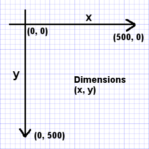

I want to create something cool with Quil!
===========================================

    This is a story of Clara who attended a ClojureBridge workshop recently.
    At the workshop, she learned what Clojure is and how to write Clojure code.
    That really impressed her, "How functional!"
    Also, Clara met an interesting drawing tool, Quil, which is written in Clojure.
    When Clara learned how to use Quil, she thought, "I want to create something cool with Quil!"
    Here's how Clara developed her own Quil application.

## Step 1. Snowflake on a blue background

Clara considered where to start while looking at her first drawing application.
Then, a small light turned on in her mind, "a white snowflake on a blue background looks nice."
What she wanted to know was how to make a background blue and put a snowflake on it.
Clara already learned how to find the way. It was:

1. Go to the API documentation website
2. Google it

Following that, Clara went to the Quil API web site,
[http://quil.info/api](http://quil.info/api), and found the
[Loading and Displaying](http://quil.info/api/image/loading-and-displaying)
section. Then, she found the
[background-image](http://quil.info/api/color/setting#background-image)
function.

Then, she googled and found a StackOverflow question,
[Load/display image in clojure with quil](http://stackoverflow.com/questions/18714941/load-display-image-in-clojure-with-quil), which
looked like helpful.
She also went to ClojureBridge drawing resources section,
[Quil and Processing Resources](https://github.com/ClojureBridge/drawing#quil-and-processing-resources).
Browsing at web sites listed there for a while, she found an interesting Xmas tree
example,
[xmas-tree.clj](https://github.com/quephird/fun-with-quil/blob/master/src/fun_with_quil/animations/xmas-tree.clj),
which displayed a xmas tree read from a file in a window.
"This should be what I want," she delighted in getting those useful search results.

OK, for now, she got enough information to accomplish step 1.

At the ClojureBridge workshop, Clara went though the Quil app
tutorial,
[Making Your First Program with Quil](https://github.com/ClojureBridge/drawing/blob/master/curriculum/first-program.md),
so she already had the `drawing` Clojure project.  She decided to use
the same project for her own app.

### step 1-1: Create a new source file

Clara added a new file under `src/drawing` directory with the name
`practice.clj`.  At this point, her directory structure looks like the
below:

```
drawing
├── LICENSE
├── README.md
├── project.clj
└── src
    └── drawing
        ├── core.clj
        ├── lines.clj
        └── practice.clj      <-- this file is added in step 1-1
```

### step 1-2: Add namespace - make the source code clojure-ish

First, Clojure source code has a namespace declaration, so Clara
copy-pasted `ns` from the top of her `lines.clj` file. But, she
changed the name from `drawing.lines` to `drawing.practice`, because
her new file has the name `practice`.

At this moment, `practice.clj` looks like this:

```clojure
(ns drawing.practice
  (:require [quil.core :as q]))
```

### step 1-3: Add basic Quil code

Basic Quil code has `setup` and `draw` functions, along with a
`defsketch` macro, which defines the app. Following these Quil rules,
Clara added those things into her `practice.clj`.

Now, `practice.clj` looks like this:

```clojure
(ns drawing.practice
  (:require [quil.core :as q]))

;; setup and draw functions and q/defsketch are added in step 1-3
(defn setup [])

(defn draw [])

(q/defsketch practice
  :title "Clara's Quil practice"
  :size [500 500]
  :setup setup
  :draw draw
  :features [:keep-on-top])
```

### step 1-4: Download and put snowflake and background images

Looking at the Quil API and the StackOverflow question, Clara learned
that where to put her image files was important. She created a new
directory, `images`, under the top `drawing` directory, and
[put two images there](https://github.com/ClojureBridge/drawing/tree/master/images).

Now, her directory structure looks like the one below:

```
drawing
├── LICENSE
├── README.md
├── images
│   ├── blue_background.png      <-- added in step 1-4
│   └── white_flake.png          <-- added in step 1-4
├── project.clj
└── src
    └── drawing
        ├── core.clj
        ├── lines.clj
        └── practice.clj
```

### step 1-5: Add framework

So far, the images were ready, the next step was to code using the Quil API.

Clara was back to the xmas tree example and learned her application needed
one more library to add, `[quil.middleware :as m]` within `:require`.
This was a quite new experience to her. To figure out what's that and how
to use, Clara walked through the document
[Functional mode (fun mode)](https://github.com/quil/quil/wiki/Functional-mode-(fun-mode)).

When she finished the document, she murmured, "Ha, fun mode, nice
name, isn't it? What I should do here is... to add":

1. `[quil.middleware :as m]` in the `ns` form
2. `:middleware [m/fun-mode]` in the `q/defsketch` form
3. function argument `state` to `draw` function

"to my `practice.clj`. OK, let's do it!"

At this moment, `practice.clj` looks like this:

```clojure
(ns drawing.practice
  (:require [quil.core :as q]
            [quil.middleware :as m]))  ;; this line is added in step 1-5

(defn setup [])

(defn draw [state])                    ;; argument state is added in step 1-5

(q/defsketch practice
  :title "Clara's Quil practice"
  :size [500 500]
  :setup setup
  :draw draw
  :features [:keep-on-top]
  :middleware [m/fun-mode])             ;; this line is added in step 1-5
```

### step 1-6: Load snowflake and background images

Clara already knew the final pieces to load images were:

1. in `setup` function, load images and return those as a **state**
2. in `draw` function, look the contents in `state` argument and draw images

So, she added a few lines of code to the `setup` and `draw` functions in
her `practice.clj`. She was careful when writing the image filenames
because it should reflect the actual directory structure.

At this moment, `practice.clj` looks like this:

```clojure
(ns drawing.practice
  (:require [quil.core :as q]
            [quil.middleware :as m]))

(defn setup []
  ;; these two lines, a map (data structure) is added in step 1-6
  {:flake (q/load-image "images/white_flake.png")
   :background (q/load-image "images/blue_background.png")}
  )

(defn draw [state]
  ;; q/background-image and q/image functions are added in step 1-6
  (q/background-image (:background state))
  (q/image (:flake state) 200 10)
  )

(q/defsketch practice
  :title "Clara's Quil practice"
  :size [500 500]
  :setup setup
  :draw draw
  :features [:keep-on-top]
  :middleware [m/fun-mode])
```

When Clara ran this code, she saw this image:


Woohoo! She made it!


#### [bonus] destructuring

Clojure has a nice feature called,
[destructuring](http://clojurebridge.github.io/community-docs/docs/clojure/destructuring/).
Using the destructuring in a function argument, we can write `draw` function like this:

```clojure
(defn draw [{flake :flake background :background}]
  (q/background-image background)
  (q/image flake 200 10))
```

Clojurians often use this handy feature.


## Step 2. Snowflake falling down

Clara was satisfied with the image of the white snowflake on the blue
background. However, that was boring. For the next step, she wanted to
move the snowflake like it was falling down. This needed further Quil
API study and googling.

As far as she searched, moving some pieces in the image is called
**animation**. The basic idea is:

- draw the image at some position
- update the position
- draw the image at updated position

So-called animations repeat these steps again and again.

### step 2-1: Add `y` parameter update

"Well," Clara thought, "What does 'moving the snowflake like it was
falling down' mean in terms of programming?"

To draw the snowflake, she used Quil's `image` function, described in
the API:
[image](http://quil.info/api/image/loading-and-displaying#image).

The x and y parameters were 200 and 10 from the upper-left corner,
which was the position she set to draw the snowflake. To make it fall
down, the y parameter should be increased as time goes by.



In terms of programming, 'moving the snowflake like it was falling
down' means:

1. Set the initial state--for example, `(x, y) = (200, 10)`
2. Draw the background first, then the snowflake
3. Update the state - increase the `y` parameter--for example, `(x, y) = (200, 11)`
4. Draw the background again first, then the snowflake
5. Repeat 2 and 3, increasing the `y` parameter.

In her application, "changing state" includes only the `y`
parameter. How could she increment the `y` value by one?

Yes, Clojure has the `inc` function. This is the function she used.

To update `y` parameter:
- Add an initial `y` parameter in the map of `setup` function, which
  represents **state**

    ```clojure
    {:flake (q/load-image "images/white_flake.png")
     :background (q/load-image "images/blue_background.png")
     :y-param 10}
    ```

-  Add a new function `update` which will increment the `y` parameter by one

    ```clojure
    (defn update [state]
      ;; updating y paraemter by one
      (update-in state [:y-param] inc))
    ```

-  Add the `update` function in the `q/defsketch` form

    ```clojure
    (q/defsketch practice
      :title "Clara's Quil practice"
      :size [500 500]
      :setup setup
      :update update
      :draw draw
      :features [:keep-on-top]
      :middleware [m/fun-mode])
    ```

### step 2-2: Draw the image on updated position

So far, the app got the feature to update `y` parameter;
however, this is not enough to make the snowflake falling down.
The snowflakes should be put on the updated position.

Clara changed the `draw` function so that `q/image` could have updated
`y` parameter.

```clojure
(defn draw [state]
  ;; drawing blue background and a snowflake on it
  (q/background-image (:background state))
  (q/image (:flake state) 200 (:y-param state)))
```

She added one more function, `(q/smooth)`, to `setup` since this would
make animation move smoothly.

At this point, `practice.clj` looks like this:

```clojure
(ns drawing.practice
  (:require [quil.core :as q]
            [quil.middleware :as m]))

(defn setup []
  (q/smooth)                                      ;; added in step 2-2
  {:flake (q/load-image "images/white_flake.png")
   :background (q/load-image "images/blue_background.png")
   :y-param 10}                                   ;; added in step 2-1
  )

;; update function is added in step 2-1
(defn update [state]
  (update-in state [:y-param] inc))

(defn draw [state]
  (q/background-image (:background state))
  (q/image (:flake state) 200 (:y-param state))    ;; changed in step 2-2
  )

(q/defsketch practice
  :title "Clara's Quil practice"
  :size [500 500]
  :setup setup
  :update update                                   ;; added in step 2-1
  :draw draw
  :features [:keep-on-top]
  :middleware [m/fun-mode])
```

When Clara ran this code--hey! She saw the snowflake was falling
down.


## Step 3. Make the snowflake keep falling down from top to bottom

Clara got a nice Quil app. But, once the snowflake went down beyond
the bottom line, that was it. Only a blue background remained on the
window. So, she wanted it to repeat again and again.

In other words: if the snowflake reaches the bottom, it should come
back to the top. Then, it should fall down again.

In terms of programming, what does that mean?

If the `y` parameter is greater than the height of the image, `y`
parameter should go back to `0`. Otherwise, the `y` parameter should
be incremented by one. That said, there exist two cases to update `y`
parameter.

Clara recalled `if` was used for
[Flow Control](http://clojurebridge.github.io/curriculum/outline/flow_control.html)
at the ClojureBridge workshop. It looked `if` would handle the two cases
well like this:

```clojure
(defn update [state]
  (if (>= (:y-param state) (q/height)) ;; y-param is greater than or equal to image height?
    (assoc state :y-param 0)           ;; true - get it back to the 0 (top)
    (update-in state [:y-param] inc)   ;; false - update y paraemter by one
    ))
```

So, she used `if` to make the snowflake go back to the top in the
update function.

At this point, `practice.clj` looks like this:

```clojure
(ns drawing.practice
  (:require [quil.core :as q]
            [quil.middleware :as m]))

(defn setup []
  (q/smooth)
  {:flake (q/load-image "images/white_flake.png")
   :background (q/load-image "images/blue_background.png")
   :y-param 10})

(defn update [state]
  ;; these three lines were added in step 3
  (if (>= (:y-param state) (q/height))
    (assoc state :y-param 0)
    (update-in state [:y-param] inc)))

(defn draw [state]
  (q/background-image (:background state))
  (q/image (:flake state) 200 (:y-param state)))

(q/defsketch practice
  :title "Clara's Quil practice"
  :size [500 500]
  :setup setup
  :update update
  :draw draw
  :features [:keep-on-top]
  :middleware [m/fun-mode])
```

Clara saw the snowflake appeared from the top after it went down below
the bottom line.


## Step 4. Make more snowflakes falling down from top to bottom

Clara thought, "It's nice to look at the snowflake falls down many
times. But I have only one snowflake. Can I add more?"
She wanted to see more snowflakes falling down: one or more on the left
half, as well as one or more on the right half.

Again, she needed to express her thoughts by the words of programming
world. Looking at her code already written, she figures out, "This
would be 'draw multiple images with the different `x` parameters.'"
The easiest way would be to copy-paste `(q/image (:flake state) 200 (:y-param state)`
multiple times with the different `x` parameters. For example,

```clojure
(q/image (:flake state) 10 (:y-param state))
(q/image (:flake state) 200 (:y-param state))
(q/image (:flake state) 390 (:y-param state))
```

But, for Clara, this did not look nice; she learned a lot about
Clojure and wanted to use what she knew.

First, she thought about how to keep multiple `x` parameters. She
remembered there was a `Vectors` in the
[Data Structures](http://clojurebridge.github.io/curriculum/outline/data_structures.html)
section, which looked a good fit in this case.

Here's what she did to add more snowflakes:

1. Add a vector which has multiple `x` parameters assigned to a name
with `def`.

    ```clojure
    (def x-params [10 200 390]) ;; x parameters for three snowflakes
    ```

2. Draw snowflakes as many times as the number of `x`-params using `doseq`.

    ```clojure
    (doseq [x x-params]
      (q/image (:flake state) x (:y-param state)))
    ```

* See, [doseq](http://clojurebridge.github.io/curriculum/outline/sequences.html#/3)

At this point, `practice.clj` looks like this:

```clojure
(ns drawing.practice
  (:require [quil.core :as q]
            [quil.middleware :as m]))

(def x-params [10 200 390])                      ;; added in step 4

(defn setup []
  (q/smooth)
  {:flake (q/load-image "images/white_flake.png")
   :background (q/load-image "images/blue_background.png")
   :y-param 10})

(defn update [state]
  (if (>= (:y-param state) (q/height))
    (assoc state :y-param 0)
    (update-in state [:y-param] inc)))

(defn draw [state]
  (q/background-image (:background state))
  (doseq [x x-params]                              ;; two lines were changed
    (q/image (:flake state) x (:y-param state))))  ;; in step 4

(q/defsketch practice
  :title "Clara's Quil practice"
  :size [500 500]
  :setup setup
  :update update
  :draw draw
  :features [:keep-on-top]
  :middleware [m/fun-mode])
```

"Yes!" Clara shouted when she saw three snowflakes kept falling down.


## Step 5. Make snowflakes keep falling down at different speed

Although her app looked lovely, Clara felt something was not quite
right. In her window, all three snowflakes fell down at the same
speed like a robots' march. It did not look natural. So, she wanted to
make them fall down at different speed.

Using programming terms, the problem here is that all three snowflakes
share the same `y` parameter.
Given that using multiple `y` parameters would solve the problem--but how?

### step 5-1 Change `y` parameters to maps with speeds

As she used `vector` for the x parameters, the `vector` would be a good data
structure to have different `y` parameters as well. However, this
should not be a simple vector since each snowflake will have two
parameters, height and speed. Having these two, Clara could change the
falling speed of each snowflake.

Well, she was back to ClojureBridge curriculum and went to
[Data Structures](http://clojurebridge.github.io/curriculum/outline/data_structures.html).
There was a data structure called `Maps` which allowed her to save
multiple parameters. Looking at maps examples, she changed the `y-param` from a
single value to a vector of 3 maps. Also, the keyword was changed from
`y-param` to `y-params`. Now her initial **state** became this:

```clojure
{:flake (q/load-image "images/white_flake.png")
 :background (q/load-image "images/blue_background.png")
 :y-params [{:y 10 :speed 1} {:y 150 :speed 4} {:y 50 :speed 2}]}
```

It was a nice data structure, actually maps in a vector in a map
including outer map. Downside was, her `update` function would not be
simple anymore. What she had to do was updating all `y` values in
the three maps within a vector.


### step 5-2 Update values in maps in the vector

Thinking both map and vector at the same time was confusing to her, so
she decided to think about map only. Each map has `y` parameter and
`speed`:

```clojure
{:y 150 :speed 4}
```
as an initial **state**. The very next moment, speed should be added
to y value. As a result, the map should be updated to:

```clojure
{:y 154 :speed 4}
```

To accomplish this map update, Clara added `update-y` function:

```clojure
(defn update-y
  [m]
  (let [y (:y m)
        speed (:speed m)]
    (if (>= y (q/height))           ;; y is greater than or equal to image height?
      (assoc m :y 0)                ;; true - get it back to the 0 (top)
      (update-in m [:y] + speed)))) ;; false - add y value and speed
```

#### [bonus] destructuring

Using Clojure's destructuring, we can write `update-y` function like
this:

```clojure
(defn update-y
  [{y :y speed :speed :as m}]
  (if (>= y (q/height))
    (assoc m :y 0)
    (update-in m [:y] + speed)))
```

As in the code, we can skip let binding.


### step 5-3 Update maps in the vector

Next step is to update maps in the vector using `update-y` function.
Before writing this part, Clara cut down the problem to focus on
updating a vector: how to update contents in a vector. She remembered
there was a `map` function which allowed her to apply a function to
each element in the vector.
[`map` function](http://clojurebridge.github.io/curriculum/outline/functions.html#/9)

For example:

```clojure
(map inc [1 2 3]) ;=> (2 3 4)
```

> Clojure has a `map` function and `map` data structure.
> Be careful, this is confusing.
> In Python, function is a `map`, data structure is dictionary.
> In Ruby, function is a `map` or `collect`, data structure is hash.

She tested the function on the insta-REPL:

```clojure
(defn update-test
  [m]
  (let [y (:y m)
        speed (:speed m)]
    (if (>= y 500)
      (assoc m :y 0)
      (update-in m [:y] + speed))))

(def y-params [{:y 10 :speed 1} {:y 150 :speed 4} {:y 50 :speed 2}])

(map update-test y-params)
;=> ({:y 11, :speed 1} {:y 154, :speed 4} {:y 52, :speed 2})
```

It looked good, so she got back to her `practice.clj` file to change
`update` function. This function should return the **state** as the
map which includes `:y-params` key with the update vector as a value.
Her `update` function became like this:

```clojure
(defn update [state]
  (let [y-params (:y-params state)]
    (assoc state :y-params (map update-y y-params))))
```


### step 5-4 Update draw function to see maps in the vector

Another challenge was the `draw` function change to see values in the
maps which were in the vector.
Clara found a couple of ways to repeat something in Clojure. Among
them, she chose `dotimes` and `nth` to repeatedly draw images; the
`nth` function is the one in the curriculum:
[Data Structures](http://clojurebridge.github.io/curriculum/outline/data_structures.html#/6)

In this case, she knew there were exactly 3 snowflakes, so she changed
the code to draw 3 snowflakes as shown below:

```clojure
(let [y-params (:y-params state)]
    (dotimes [n 3]
      (q/image (:flake state) (nth x-params n) (:y (nth y-params n)))))
```

At this point, her entire `practice.clj` looks like this:

```clojure
(ns drawing.practice
  (:require [quil.core :as q]
            [quil.middleware :as m]))

(def x-params [10 200 390])

(defn setup []
  (q/smooth)
  {:flake (q/load-image "images/white_flake.png")
   :background (q/load-image "images/blue_background.png")
   :y-params [{:y 10 :speed 1} {:y 150 :speed 4} {:y 50 :speed 2}]})  ;; changed in step 5-1

;; update-y function was added in step 5-2
(defn update-y
  [m]
  (let [y (:y m)
        speed (:speed m)]
    (if (>= y (q/height))
      (assoc m :y 0)
      (update-in m [:y] + speed))))

(defn update [state]
  (let [y-params (:y-params state)]                   ;; update function
    (assoc state :y-params (map update-y y-params)))) ;; was changed in step 5-3

(defn draw [state]
  (q/background-image (:background state))
  (let [y-params (:y-params state)]   ;; three lines below were changed in step 5-4
    (dotimes [n 3]
      (q/image (:flake state) (nth x-params n) (:y (nth y-params n))))))

(q/defsketch practice
  :title "Clara's Quil practice"
  :size [500 500]
  :setup setup
  :update update
  :draw draw
  :features [:keep-on-top]
  :middleware [m/fun-mode])
```

When she ran the code, three snowflakes kept falling down at
different speeds. It looked more natural.


## Step 6. Do some "refactoring"

Clara looked at her `practice.clj` thinking her code got longer for a while.

Scanning her code from top to bottom again, she thought
"`x-params` may be part of the **state**," for example:

```clojure
[{:x 10 :y 10 :speed 1} {:x 200 :y 150 :speed 4} {:x 390 :y 50 :speed 2}]
```

She found that this new data structure was easy to maintain the state of each snowflake.

So, she changed her `setup` function to return the initial **state** which
included x parameters also. The key name was changed from `:y-params`
to `:params`:

```clojure
{:flake (q/load-image "images/white_flake.png")
   :background (q/load-image "images/blue_background.png")
   :params [{:x 10  :y 10  :speed 1}
            {:x 200 :y 150 :speed 4}
            {:x 390 :y 50  :speed 2}]}
```

Clara stared at `update-y` function and concluded to leave as it was.
Since existence of `:x` and its value didn't affect updating y value.
The function returned the map with three keys with each value.

What about `update` function? This needed a little change since key
name was changed from `:y-params` to `:params`.

```clojure
(defn update [state]
  (let [params (:params state)]
    (assoc state :params (map update-y params))))
```

The `draw` function would have a bigger change since the way to
extract x values was changed.
At first, Clara changed `dotimes` function like this:

```clojure
(let [params (:params state)]
  (dotimes [n 3]
    (q/image (:flake state) (:x (nth params n)) (:y (nth params n)))))
```

But, the exact the same thing, `(nth params n)`, appeared twice.
"Is there anything better to avoid repetition?" she thought.
The answer was easy - use `let` binding within `dotimes` function.
Using `let`, her `dotimes` form turned to:

```clojure
(let [params (:params state)]
  (dotimes [n 3]
    (let [param (nth params n)]
      (q/image (:flake state) (:x param) (:y param)))))
```

The last line above got much cleaner!

At this moment, her entire `practice.clj` looks like this:

```clojure
(ns drawing.practice
  (:require [quil.core :as q]
            [quil.middleware :as m]))

(defn setup []
  (q/smooth)
  {:flake (q/load-image "images/white_flake.png")
   :background (q/load-image "images/blue_background.png")
   :params [{:x 10  :y 10  :speed 1}                       ;; changed in step 6
            {:x 200 :y 150 :speed 4}
            {:x 390 :y 50  :speed 2}]})

(defn update-y
  [m]
  (let [y (:y m)
        speed (:speed m)]
    (if (>= y (q/height))
      (assoc m :y 0)
      (update-in m [:y] + speed))))

(defn update [state]
  (let [params (:params state)]                    ;; changed to params in step 6
    (assoc state :params (map update-y params))))  ;;

(defn draw [state]
  ;; drawing blue background and mutiple snowflakes on it
  (q/background-image (:background state))
  (let [params (:params state)]                            ;; changed in step 6
    (dotimes [n 3]                                         ;;
      (let [param (nth params n)]                          ;;
        (q/image (:flake state) (:x param) (:y param)))))) ;;

(q/defsketch practice
  :title "Clara's Quil practice"
  :size [500 500]
  :setup setup
  :update update
  :draw draw
  :features [:keep-on-top]
  :middleware [m/fun-mode])
```

She saw the exact same result as the step 5, but her code
looked nicer. This sort of work is often called "refactoring".

## Step 7. Make snowflakes swing as they fall down

Clara was getting much familiar with Clojure coding. Her Quil app was
getting much more fantastic, as well!

However, looking at the snowflakes falling down, she thought she could
swing them left and then right as they fall down. Right now, all of the
snowflakes were falling straight down.

In programming terms, the `x` parameter should either increase or
decrease when the value is updated. This means that the `update`
function should update the `x` parameters as well as the `y`
parameters.

To write this feature, she changed the initial state to this:

```clojure
[{:x 100 :swing 10 :y 10 :speed 8}
 {:x 400 :swing 5 :y 300 :speed 11}
 {:x 700 :swing 8 :y 100 :speed 9}]
```

The map got a new `:swing` key, which holds a range of left and right
from a current position.

This means that the updated `x` parameter will have a value between
the current `x` parameter + `swing` and the current `x` parameter -
`swing`. For example, the first snowflake's next `x` parameter will be
between `100 + 10` and `100 - 10`.

To update the `x` parameter by a random value between some range, she
needed to do something not just using the existing clojure functions.
She found [`rand-int`](http://clojuredocs.org/clojure.core/rand-int)
from [Clojure Cheat Sheet](http://clojure.org/cheatsheet), but it only
returned between `0` and a specified value.

Googling led her to this clojure code (from
[https://github.com/sjl/roul/blob/master/src/roul/random.clj](https://github.com/sjl/roul/blob/master/src/roul/random.clj)
):

```clojure
(defn rand-int
  "Return a random int between start (inclusive) and end (exclusive).
  start defaults to 0
  "
  ([end] (clojure.core/rand-int end))
  ([start end] (+ start (clojure.core/rand-int (- end start)))))
```

This was the random generation function that she wanted. But, she
wanted a bit more.

When the value goes to less than `0`, it should take the value of the
image width, so that the snowflake will appear from the
right. Likewise, when the value goes more than the image width, it
should have value `0` so that the snowflake will appear from the left.

She couldn't use `if` anymore here, since `if` takes only one
predicate (comparison). Instead of `if`, she used `cond` and wrote an
`update-x` funcion.

```clojure
(defn update-x
  [x swing]
  (let [start (- x swing)
        end (+ x swing)
        new-x (+ start (rand-int (- end start)))]
    (cond
     (> 0 new-x) (q/width)
     (< (q/width) new-x) 0
     :else new-x )))
```

This `update-x` function hinted to her that she could refactor the
update function and write an `update-y` function. The below is the
`update-y` function.

```clojure
(defn update-y
  [y speed]
  (if (>= y (q/height))
    0
    (+ y speed)))
```

Lastly, she rewrote the `update` function.

She could still use `assoc`, but it would be like this:

```
(assoc (assoc p :y (update-y (:y p) (:speed p))) :x (update-x (:x p) (:swing p)))
```

She remembered that there was another function for maps. It was
`merge`, which was appeared in
[More Functions](https://github.com/ClojureBridge/curriculum/blob/master/outline/functions2.md).

Using `merge`, her `update` function turned into this:

```clojure
(defn update [state]
  (for [p state]
    (merge p {:x (update-x (:x p) (:swing p)) :y (update-y (:y p) (:speed p))})))
```

At this point, her entire `practice.clj` looks like this:

```clojure
(ns drawing.practice
  (:require [quil.core :as q]
            [quil.middleware :as m]))

(def flake (ref nil))        ;; reference to snowflake image
(def background (ref nil))   ;; reference to blue background image

(defn setup []
  ;; loading two images
  (dosync
   (ref-set flake (q/load-image "images/white_flake.png"))
   (ref-set background (q/load-image "images/blue_background.png")))
  (q/smooth)
  (q/frame-rate 30)
  [{:x 100 :swing 10 :y 10 :speed 8}
   {:x 400 :swing 5 :y 300 :speed 11}
   {:x 700 :swing 8 :y 100 :speed 9}])

(defn update-x
  [x swing]
  (let [start (- x swing)
        end (+ x swing)
        new-x (+ start (rand-int (- end start)))]
    (cond
     (> 0 new-x) (q/width)
     (< (q/width) new-x) 0
     :else new-x )))

(defn update-y
  [y speed]
  (if (>= y (q/height)) ;; y is greater than or equal to image height?
    0                   ;; true - get it back to the 0 (top)
    (+ y speed)))       ;; false - add a value of speed

(defn update [state]
  (for [p state]
    (merge p {:x (update-x (:x p) (:swing p)) :y (update-y (:y p) (:speed p))})))

(defn draw [state]
  ;; drawing blue background and mutiple snowflakes on it
  (q/background-image @background)
  (dotimes [n 3]
    (let [snowflake (nth state n)]
      (q/image @flake (:x snowflake) (:y snowflake)))))

(q/defsketch practice
  :title "Clara's Quil practice"
  :size [1000 1000]
  :setup setup
  :update update
  :draw draw
  :middleware [m/fun-mode])
```

(frame-rate has been changed to 30)

When Clara ran this code, she saw snowflakes were falling down,
swinging left and right randomly.

Even though there were a couple of problems as well as room for more
refactoring, Clara was satified with her app. Moreover, she started
thinking about her next, more advanced app in Clojure!

The End.


--------------
Snowflake is designed by Freepik, http://www.flaticon.com/packs/snowflakes
